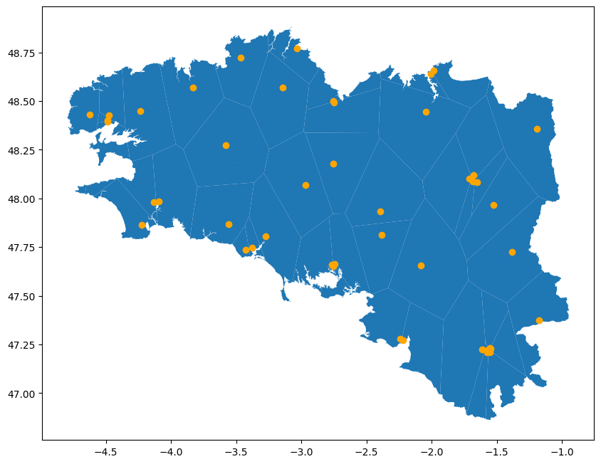
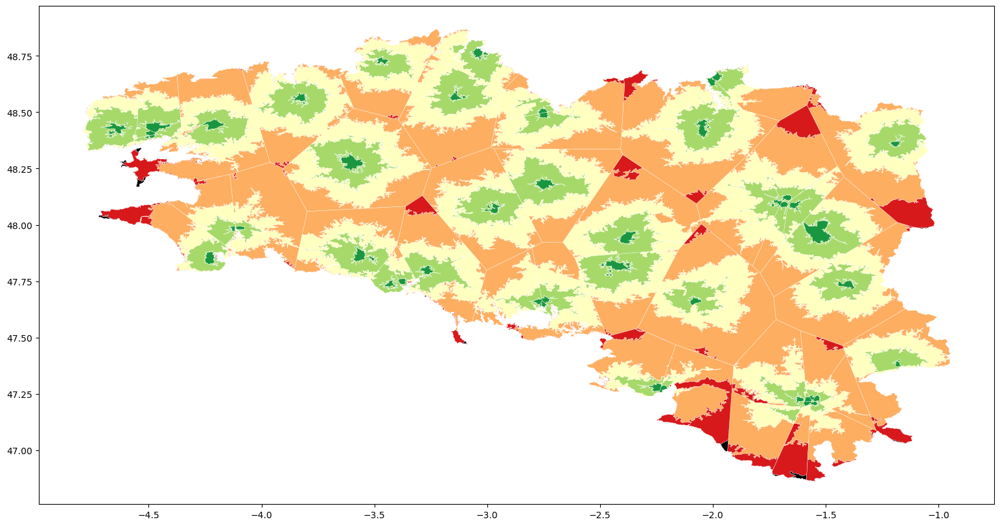

J'ai eu le plaisir de réaliser mes premières pige pour Splann! cette année. Pour le dernier volet de l'enquête sur [l'état de l'hôpital dans la région](https://splann.org/enquete/hopital-destruction-programmee/), je me suis penché sur un type de cartographie particulièrement ambitieux : **une isochrone articulée autour des temps de trajet en voiture pour rejoindre la maternité la plus proche à vol d'oiseau** :

La principale inspiration était [la carte dressée par Cédric Rossi](https://www.ign.fr/files/default/2024-09/Proximite_urgences_CRossi_0.png) sur les services d'urgences en France. Ce dernier était disposé à nous filer un coup de main sur les données qu'il avait utilisées, mais j'ai suggéré d'essayer de trouver notre propre chemin, afin de faire du sur mesure pour la cartographie finale. 

Des urgences, nous sommes finalement passés à **l'implantation des maternités en Bretagne et Loire-Atlantique**, pour les années 2000 et 2023. C'était un travail imposant avant d'aboutir à une cartographie interactive en JavaScript, que j'ai tenu à documenter de la façon que j'espère la plus complète possible (en tout cas en ce qui concerne la partie de données). 

Il y a donc **un calepin Jupyter à disposition** pour chaque partie de la recette, cliquable dans le titre, **ainsi que sa version scriptée** si jamais une personne désirant recycler ce travail ne voulait pas s'embarrasser de texte explicatif.

Pour toute remarque ou question, voici mon adresse courriel : raphadasilva\[at\]proton.me

# Partie 1 : [géocoder les maternités](https://github.com/raphadasilva/blog_rdasilva/blob/master/autodonnees/isochrones_bzh/0_geocode.ipynb)

Au programme, nous partons des adresses fournies dans les statistiques officielles afin de les transformer en coordonnées longitude/latitude indispensables à la cartographie.

# Partie 2 : [calculer le diagramme de Voronoï correspondant](https://github.com/raphadasilva/blog_rdasilva/blob/master/autodonnees/isochrones_bzh/1_geovoronoi.ipynb)

A l'aide des points cartographiés avant, nous pouvons maintenant dresser un diagramme de Voronoï afin d'établir la zone d'influence de chaque maternité. Mais, qu'est-ce qu'un diagramme de Voronoï ? La réponse est dans le tuto !

# Partie 3 : [récupérer les données isochrones de chaque maternité en se pliant à chaque dalle du diagramme](https://github.com/raphadasilva/blog_rdasilva/blob/master/autodonnees/isochrones_bzh/2_isochrones.ipynb)

Enfin le plat de résistance. Nous voyons non seulement comment dresser une carte isochrone pour chaque maternité, mais aussi une manière de les découper suivant une zone d'influence.

